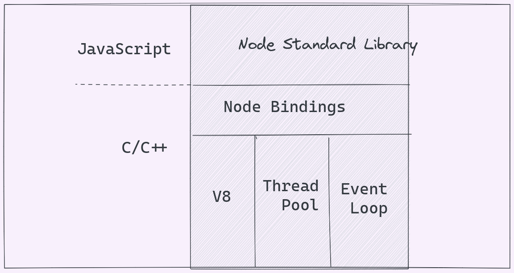

I really didn't like Nodejs or JavaScript as a programming language due to its seemingly difficult to understand programming constructs--and this
made me shy away from web programming especially front-end programming that makes heavy use of the JavaScript programming language. But with time,
I started giving myself to understand the language (JavaScript) and the runtime (Nodejs). This is true for understanding anything, innit?--getting to 
understand the basic building blocks and fundamental ideas that stack up to become the very intricate and often intitmidating-to-beginners systems.
It's a fact that if we give it time (and thorough learning), we can grok anything no matter how intricate it may seem.

I love backend engineering and my first exposure to nodejs was through the express.js framework. I think this is the way it is for most beginner programmers. But premature exposure to frameworks like this can make us lose sight of the fundamental idea or underlying details and principles of a programming language or runtime.

## Programming Paradigms

A programming paradigm is an approach or method of programming a computer based on a mathecoherent set of principles. Each paradigm supports a set of concepts that makes it the best for a certain kind of problem.
### ???

Nodejs uses the event driven approach of programming (event-driven paradigm) such that:

- No function should perform direct I/O, to receive data from disk, network or another process, there must be a callback.
- the API should be familiar to client-side JS and Unix programming interface. 

At a very high level, nodejs event-driven approach to programming is not quite different from browser JavaScript event driven approach. For instance, I later understood that
```server.on()``` is not different from ```server.addLister()``` just like the way you add event listeners to 
`HTMLElemnts` like:
```js
document.getElementById('btn').addEventListener(eventName, callback)
```
As a matter of fact, ```server.on()``` is just an alias for ```server.addListener()``` addcording to the Node.js docs. The key idea in nodejs is, every object that will implement this functionality inherits from the `EventEmitter` class.

<!--  -->


## Events and EventEmitters.

# Node Event Loop
It as a C program and is part of libuv. It is a design pattern that ochestrates or co-ordinates the execution of synchronous and asynchronous code in Node.js in six different queues. All JavaScript, V8, and the event loop run in one thread, called the main thread.  A common misconception is to think that
the event loop runs in a separate thred to the user code or the event loop handles every asynchronous operation in the thread pool.

## Q & A
1. Whenever an async task completes in libuv, at what point does Nodejs decide to run the associated callback function on the call stack? Callback functions are executed only when the callstack is empty. The normal flow of execution will not be interrupted to run a callback function.

2. What about async methods like setTimeout and setInterval which also delay the execution of a callback function? setTimeout and setInterval callbacks are given priority first.

3. If two async tasks such as setTimeout and readFile complete at the same time, how does Node decide which callback function to run first on the call stack? Timer callbacks are executed before I/O callbacks even if both are ready at the exact same time.

## Execution Order.
User written sychronous JavaScript code takes priority over async code that the runtime would like to execute. The other of execution for the different phases is as follows:

1. Any callbacks in the micro task queues are executed. First, tasks in the ```nextTick()``` queue and only then tasks in the promise queue.
2. All callbacks within the timer queue are executed.
3. Any callbacks in the micro task queues if present are executed. Again, first tasks in the ```nextTick()``` queue and only then tasks in the promise queue.
4. All callbacks within the I/O queue are executed.
5. Any callbacks in the micro task queues if present are executed. Again, first tasks in the ```nextTick()``` queue and only then tasks in the promise queue.
6. All callbacks in the check queue (```setImmediate```) are executed.
7. Any callbacks in the micro task queues if present are executed. Again, first tasks in the ```nextTick()``` queue and only then tasks in the promise queue.
8. All callbacks in the close queue are executed.
9. Any callbacks in the micro task queues if present are executed. Again, first tasks in the ```nextTick()``` queue and only then tasks in the promise queue.

If there are more callbacks to be processed, the event loop is kept alive for one more run and the same steps are repeated. On the otherhand, if all callbacks are executed and there is no more code to process, the event loop exits.


## Phases.

### Microtask Queues.
Microtask queues are executed in between each queue and also in between each callback execution in the timer and check queues.

1. nextTick queue.
 ```js
 process.nextTick(() => {
    console.log("this is process.nextTick()");
 });
 ```
 ```process.nextTick()``` should be used with caution as it can cause the rest of the event loop to starve due to its high priority. If you endlessly or carelessly call ```process.nextTick()```, the control will never make it past the microtask queue.

2. Promise queue. Any API or function that returns a promise.

```js
Promise.resolve().then(() => {
    console.log("this is a promise");
});
```

### Timer queues.
They are executed in FIFO order...although the timer queue is a min heap data structure.
1. setTimeout queue.
```js
setTimeout(() => {
    console.log("this is a timer callback");
});
```

2. setInterval queue.

### I/O queue.
Most of the async methods for perform i/o operations from the built-in modules queue the callback
function in the I/O queue. e.g ```fs.readFile()```. I/O queue callbacks are executed after timer queue callbacks. I/O polling events are polled and callback functions are added to the I/O queue only after the I/O is complete.

### Check Queue.
To queue a function into the check queue, we can use the ```setImmediate()``` function.
```js
setImmediate(() => {
    console.log("setImmediate function for check queue");
});
```
check queue callbacks are executed after microtask queues callbacks, timer queue callbacks and I/O queue callbacks are executed.

### Close queue.
Close queue callbacks are executed after all other queues callbacks in a given iteration of the event loop are executed. Callbacks are added to the close queue by adding event listeners to close event.

## References.
